# Android avec Java - LAB 3: Navigation entre activités

# Création de l’interface du formulaire — activity_main.xml

  

 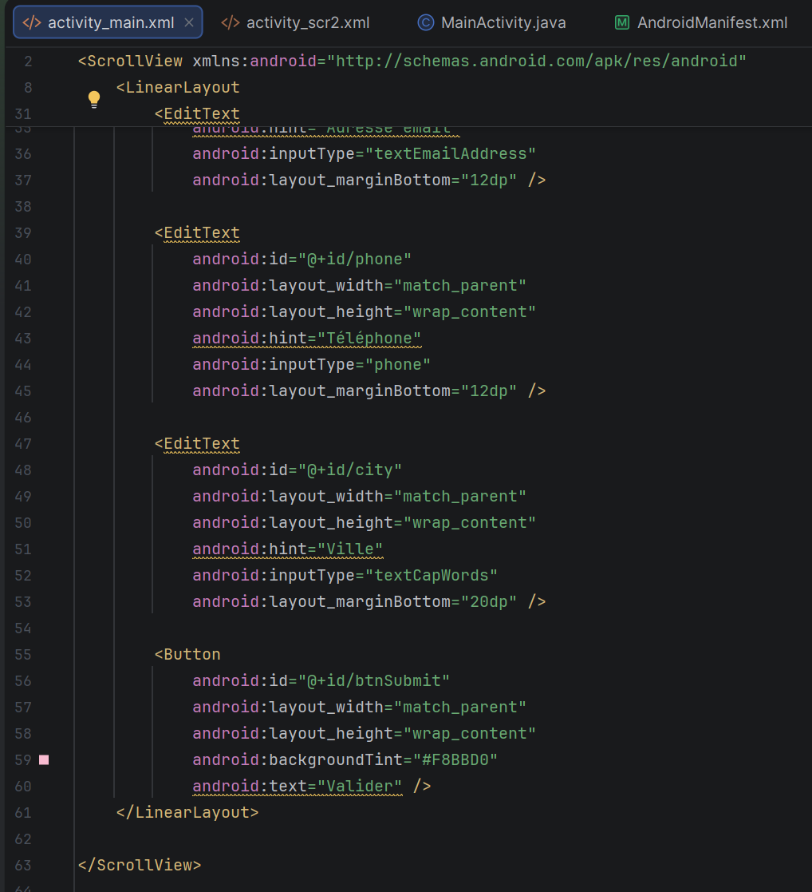 

# L'interface de screen 2 : activity_scr2.xml

 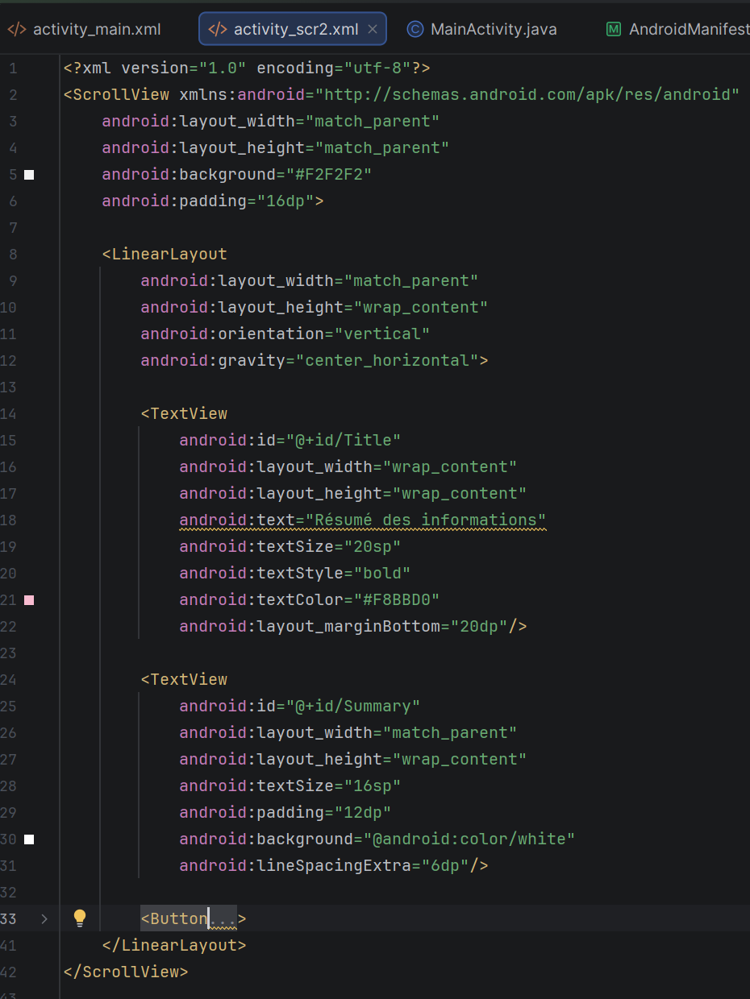 

 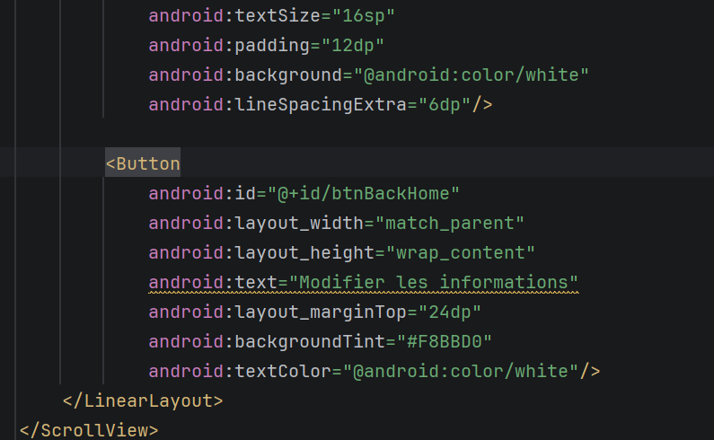 

# Formulaire — MainActivity.java:

 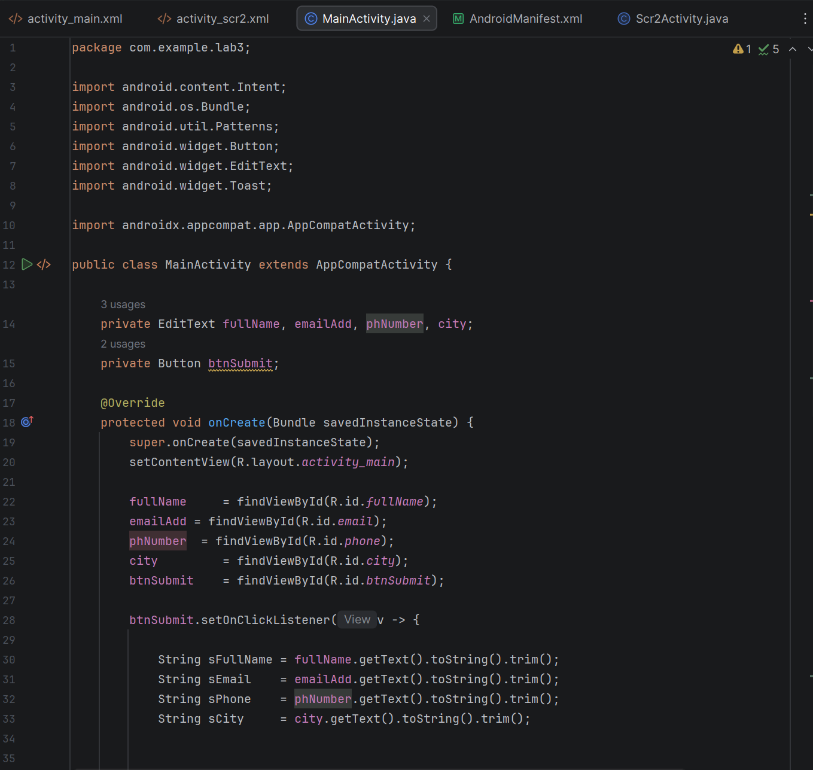 

  

# Formulaire - Scr2Activity.java

 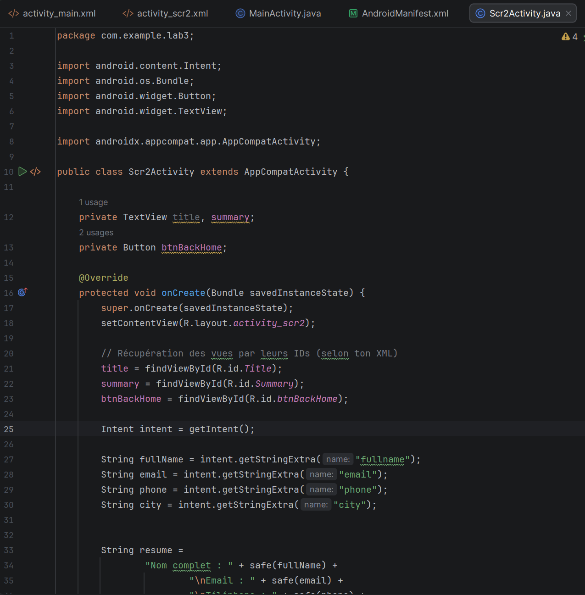 

 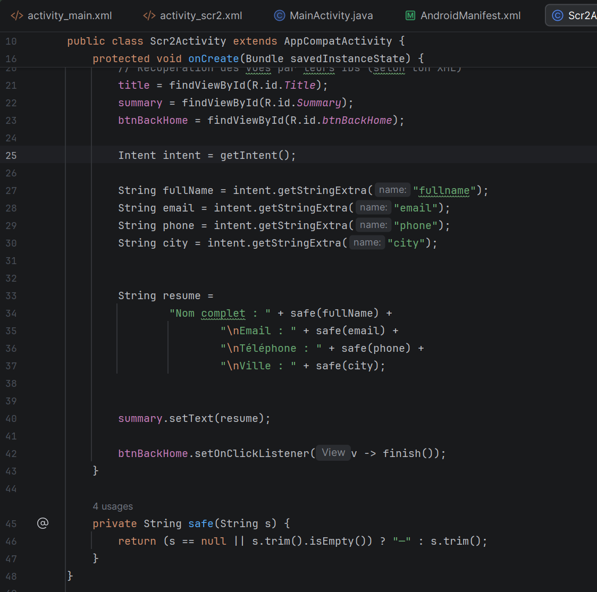 

# Configuration des activités — AndroidManifest.xml:

  

# Vérification et exécution de l’application :

 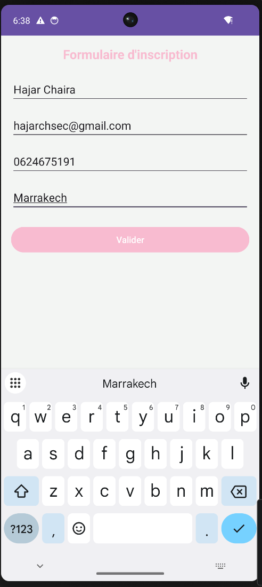 
 

 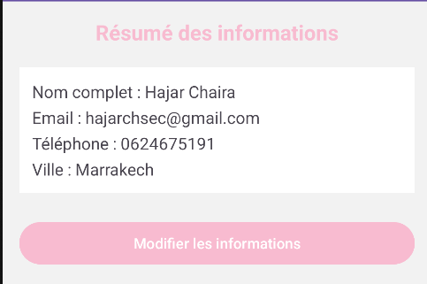 
 

# Bonus :

 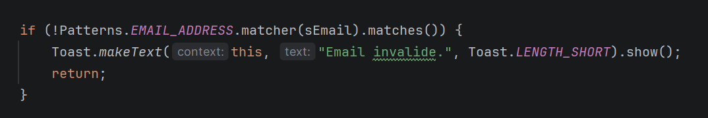 

 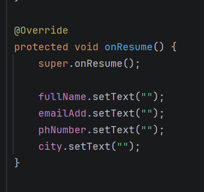 

## Avant verification d' Email:

 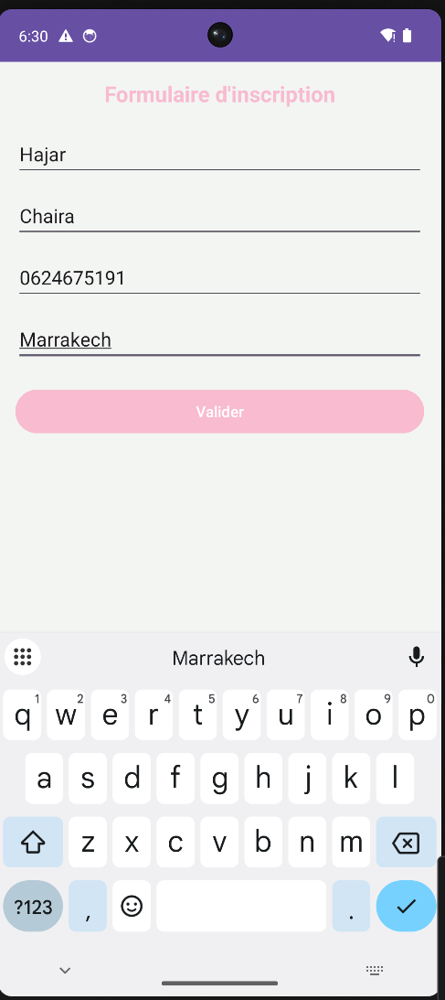 
 

 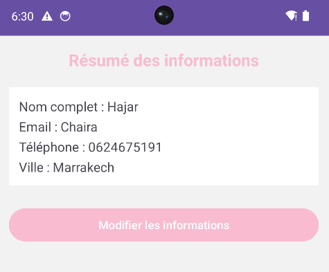 
 

## Apres Verification :- Email Invalid
 
 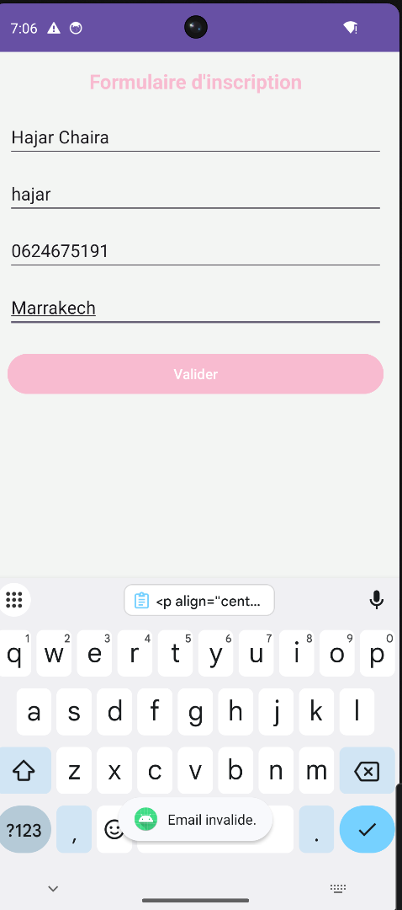 
 
