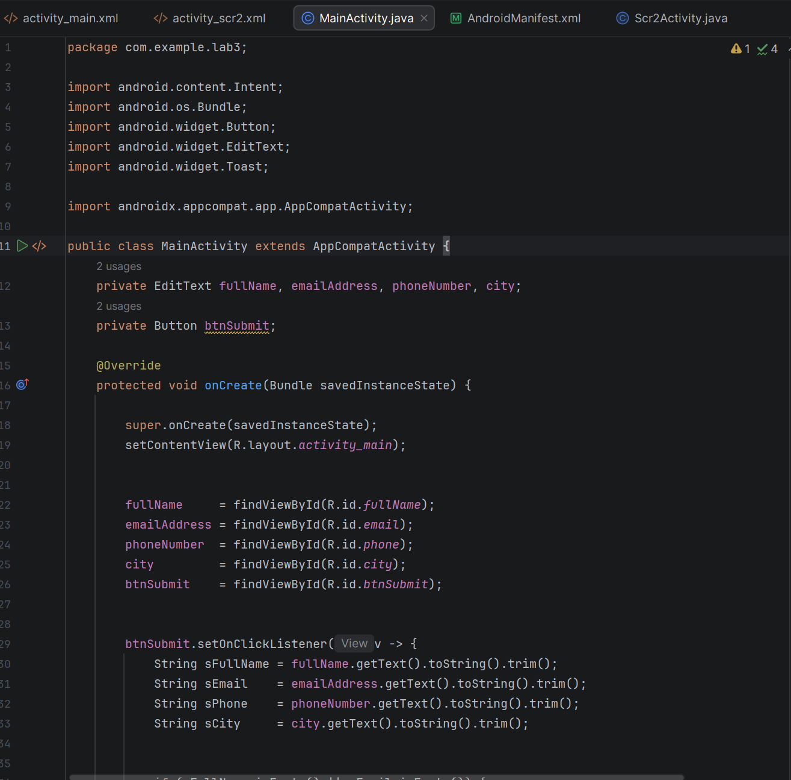
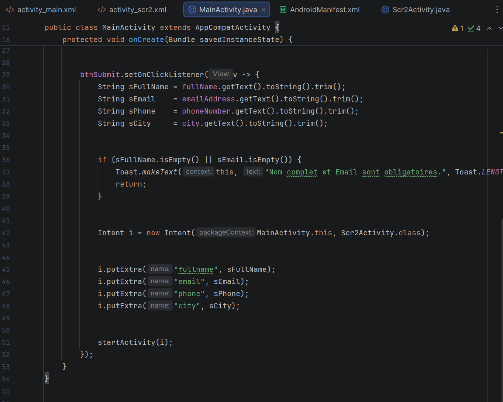

# Android avec Java - LAB 3: Navigation entre activités

# Création de l’interface du formulaire — activity_main.xml

  

  

# L'interface de screen 2 : activity_scr2.xml

  

# Formulaire — MainActivity.java:

  

  

# Formulaire - Scr2Activity.java

  

2. Les routes par défaut avec ´ip route ´:

3. Tester l'Internet:

## Step 5 : Création d’un point de restauration(snapshot) :

  
 

  
 

## Step 6 : Mise en place de l’environnement Android pour les tests :
1. Activation de mode developpeur sur mon telephone dans Parametres en appuiant 7 fois sur Build number 

  

2. Dans Options pour developpeurs , on active USB DEBUGGING :

  

3. Dans VirtualBox, sur la machine click droit et on choisit Parametres puis USB , ensuite on clique sur +ajouter et on selectionne le telephone dans la liste :

  

4. Verifier ladb dans Mobexler:

  
 
  

